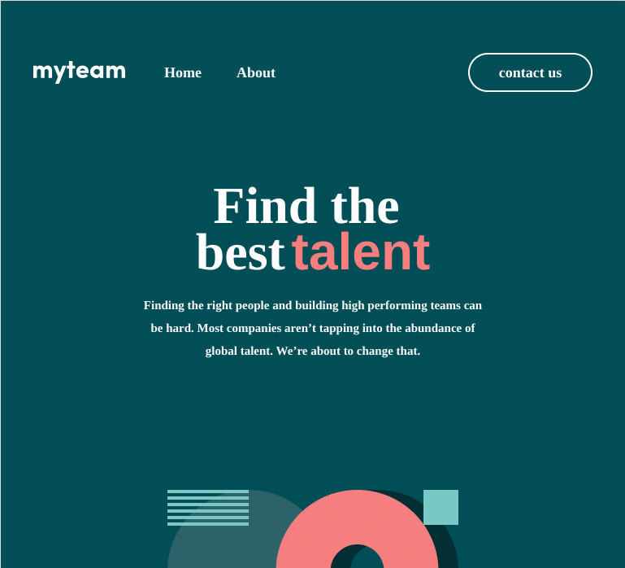

# MyTeam - WordpressStack

## Table of Contents
1. [Cross-Browser Testing](#cross-browser-testing)
2. [Fluid Layouts](#fluid-layouts)
3. [Mobile-First](#mobile-first)
4. [Breakpoints](#breakpoints)
5. [Accessibility (a11y)](#accessibility-a11y)
   - [Keyboard Navigation](#keyboard-navigation)
   - [ARIA Roles](#aria-roles)
   - [Alt Text for Images](#alt-text-for-images)
   - [Accessibility Testing with Axe](#accessibility-testing-with-axe)
   - [Accessibility Testing with WAVE](#accessibility-testing-with-wave)
6. [Performance Optimization](#performance-optimization)
   - [Font Optimization](#font-optimization)
   - [Lazy Loading and JavaScript Optimization](#lazy-loading-and-javascript-optimization)
   - [Image Optimization](#image-optimization)
7. [SEO Optimization](#seo-optimization)
   - [SEO Title](#seo-title)
   - [SEO Description](#seo-description)

---

## Screenshots

### Desktop View

### Tablet View

### Mobile View

---

## Cross-Browser Testing

I ensured consistent design performance across **Mozilla Firefox**, **Google Chrome**, and **Microsoft Edge**, focusing on different viewport widths for each browser.

## Fluid Layouts

In this project, I have ensured that the layout is fully responsive and adapts smoothly to different screen sizes. For a pixel-perfect design, I focused on three key breakpoints: mobile (375px), tablet (768px), and desktop (1440px). 

To achieve fluidity across all screen sizes, I used **percentage-based widths**, **Flexbox**, and **CSS Grid** to create flexible layouts. These techniques allow elements to scale and adjust based on the available screen space, ensuring the design remains consistent and functional.

Moreover, I utilized **root calculations** (`rem` and `em` units) to maintain consistent spacing, font sizes, and other elements across all devices, ensuring a seamless, fluid experience regardless of screen size.

## Mobile-First

In this project, I followed a **Mobile-First** approach, designing for the smallest screens first and progressively enhancing the layout for larger devices. This strategy ensures that the core functionality and design work seamlessly on mobile devices, providing an optimal user experience even on constrained screen sizes.

Once the mobile layout was perfected, I used **media queries** to progressively enhance the design for larger screen sizes such as tablets (768px) and desktops (1440px). At each breakpoint, the layout adjusts smoothly, adding or expanding elements to take advantage of the larger screen real estate. This ensures that the design remains consistent, functional, and visually appealing across all device sizes.

## Breakpoints

These are the breakpoints used in the project, targeting various device screen widths:

- **320px**: Very small smartphones (portrait)
- **360px**: Small smartphones (portrait)
- **375px**: Small-medium smartphones (portrait)
- **390px**: Small-medium smartphones (portrait)
- **414px**: Small smartphones (portrait)
- **480px**: Smaller smartphones (portrait)
- **540px**: Small-medium smartphones
- **568px**: Medium smartphones (portrait)
- **600px**: Larger smartphones or small tablets (portrait)
- **640px**: iPhone 5/5s (landscape)
- **667px**: iPhone 6/7/8 (portrait)
- **750px**: iPhone 6/7/8 Plus (portrait)
- **800px**: Small tablets (landscape)
- **834px**: iPad Mini (portrait)
- **1024px**: Tablets (portrait) or small laptops
- **1194px**: Larger tablets or smaller desktops
- **1200px**: Desktop or large tablets
- **1280px**: Standard laptops or desktops
- **1366px**: Laptops or small desktops
- **1512px**: Large laptops or desktop screens
- **1536px**: Large desktop monitors
- **1600px**: Large desktops or wide laptops
- **1920px**: Full HD monitors
- **2560px**: Ultra-wide or 4K displays

---

## Accessibility (a11y)

### Keyboard Navigation

- I have ensured that all links are tabbable, allowing users to easily navigate through the site.

### ARIA Roles

I have added ARIA attributes to enhance accessibility for screen readers and assistive technologies. Specifically, the following improvements were made:

- **`aria-label`**: Added to custom components, like pricing, to provide clear and descriptive labels, ensuring assistive technologies can accurately communicate the purpose of each component.  
- **`aria-describedby`**: Used to associate form fields with error messages or additional instructions, offering users contextual guidance during interactions.  
- **`aria-live="polite"`**: Implemented for error messages to ensure they are dynamically announced to users by assistive technologies without interrupting their workflow.  

These additions make the interface more inclusive and improve the overall user experience for all users, including those relying on assistive tools.

### Alt Text for Images

- I have added `alt` text on all images that aren't used as background images, ensuring that screen readers can interpret them for better accessibility.

### Alt Text for Images

- I have added `alt` text on all images that aren't used as background images, ensuring that screen readers can interpret them for better accessibility.

### Accessibility Testing with Axe

- I have tested the site using the Axe DevTools browser extension to identify and resolve accessibility issues. The testing ensures compliance with WCAG 2.1 AA standards.
- All detected issues from Axe have been reviewed and addressed where applicable to improve the overall accessibility of the site.

### Accessibility Testing with WAVE

- I have tested the site using the WAVE Web Accessibility Evaluation Tool to identify potential accessibility issues.  
- While WAVE flagged the contrast on the "About" buttons as insufficient, I decided to retain the current color scheme for design consistency and brand identity.  
- To balance aesthetics and accessibility, I ensured that all other interactive elements meet contrast requirements and implemented additional accessibility features to enhance the overall user experience.  

---

## Performance Optimization

### Font Optimization

To enhance site performance, I focused on **Font Optimization** by preloading custom fonts and ensuring they load asynchronously. This approach reduces render-blocking issues and improves page speed significantly.

These optimizations resulted in **significant speed improvements**, as verified by tools like Google Lighthouse and PageSpeed Insights. Render-blocking delays caused by custom font loading were eliminated while maintaining the visual integrity of the design.

### Lazy Loading and JavaScript Optimization

To enhance site performance, I optimized the loading of JavaScript by using the `defer` attribute, which improves load times and overall user experience.

1. **JavaScript Deferred Loading**:  
   - I applied the `defer` attribute to non-critical JavaScript files, ensuring they load after the page content is parsed. This reduces render-blocking and allows the page to become interactive faster.

This optimization resulted in faster page load times and improved performance metrics, contributing to a better user experience.

### Image Optimization

To enhance performance, I prioritized **image optimization** throughout the project. All images were compressed by converting them from PNG to the modern **WebP** format, significantly reducing file sizes while maintaining high-quality visuals. This optimization saved substantial storage space and improved page loading times.

For vector graphics, I retained **SVG** for icons due to their scalability and minimal file size. SVGs are ideal for responsive designs as they adapt to different resolutions without losing quality. By combining WebP for raster images and SVG for icons, the site achieves an optimal balance of performance and visual fidelity.

---

### SEO Optimization

In this project, I have used the **`seo-title`** and **`seo-description`** tags to enhance search engine optimization (SEO). These tags are important for improving visibility and click-through rates from search engine results pages (SERPs).

- **SEO Title**: This tag defines the title of the page as it will appear in search engine results.
- **SEO Description**: This provides a brief summary of the page content and is displayed under the SEO title in search results.

Both tags were carefully crafted to improve the page's SEO ranking and provide a better user experience when the page is listed in search engines.